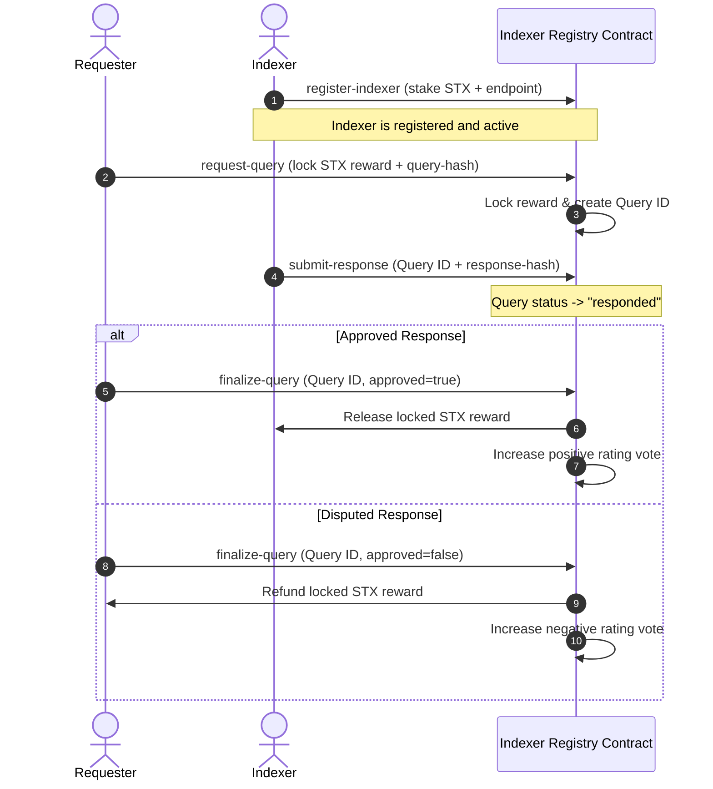

# The Indexer (Stacks / Clarity Protocol)

A decentralized indexer registry and query protocol built on the **Stacks Blockchain** using the **Clarity Smart Contract Language**. 

This repository implements the core on-chain staking registry, query lifecycle (request, response, finalization), reputation/rating mechanism, and slashing logic for indexers on Stacks, allowing Stacks-native applications to source reliable indexed off-chain data trustlessly.

Author: **rindicomfort** (<kwarpojonathanrindi@gmail.com>)

---

## Architecture Overview



### Core Features

1. **Staking & Registration (`register-indexer`):** Indexers register their endpoint API URLs by staking a minimum of `100 STX`. Staking ensures economic commitment and alignment.
2. **Query Lifecycle Management (`request-query`, `submit-response`, `finalize-query`):**
   - Requesters lock STX rewards alongside a cryptographic hash of their query request.
   - Active indexers process the query, compute results, and submit a cryptographic hash of the response on-chain.
   - Requesters verify the response payload off-chain and finalize the query. If correct, the reward is released; otherwise, it is refunded and marked as disputed.
3. **Decentralized Reputation (`IndexerScores`):** Stores positive and negative performance votes of indexers, helping users select high-performance indexers.
4. **Economic Slashing (`slash-indexer`):** If an indexer behaves maliciously or experiences sustained offline issues, the contract owner can slash a portion of their stake (`50 STX` default penalty) to protect the network.

---

## Directory Structure

```text
├── Clarinet.toml         # Clarinet configuration (Clarity 2, Epoch 2.4)
├── contracts/
│   └── indexer-registry.clar   # Core Stacks Smart Contract
├── frontend/
│   ├── index.html        # Interactive dashboard interface
│   ├── index.css         # Dashboard styling (dark mode violet theme)
│   ├── app.js            # Wallet connection & dashboard simulation logic
│   └── indexer-node.ts   # Node client script for listening/answering queries
├── tests/
│   └── indexer-registry.test.ts  # Vitest unit tests
├── package.json          # Node/npm dependency details
└── tsconfig.json         # TypeScript configurations
```

---

## Getting Started

### Prerequisites

Ensure you have the following installed:
- [Clarinet](https://github.com/hirosystems/clarinet) (CLI tool for Stacks contracts)
- [Node.js](https://nodejs.org/) (v18+ recommended)

### Installation

Install TypeScript and testing dependencies:
```bash
npm install
```

### Verification & Testing

Verify Clarity syntax check:
```bash
clarinet check
```

Run unit tests simulating blockchain state:
```bash
npm test
```

Expected output:
```text
 ✓ tests/indexer-registry.test.ts (5 tests)
   ✓ Indexer Registry contract tests
     ✓ allows a node to register as an indexer with sufficient STX stake
     ✓ fails registration if the STX stake is below the minimum limit
     ✓ allows updating the API endpoint URL
     ✓ supports submitting query requests, responding, and transferring rewards
     ✓ allows the owner to slash malicious or offline indexers
```

### Running the Indexer Node Client

You can run the mock indexer node daemon which shows transaction construction with Stacks JS SDK:
```bash
npx ts-node frontend/indexer-node.ts
```

---

## License
MIT License
